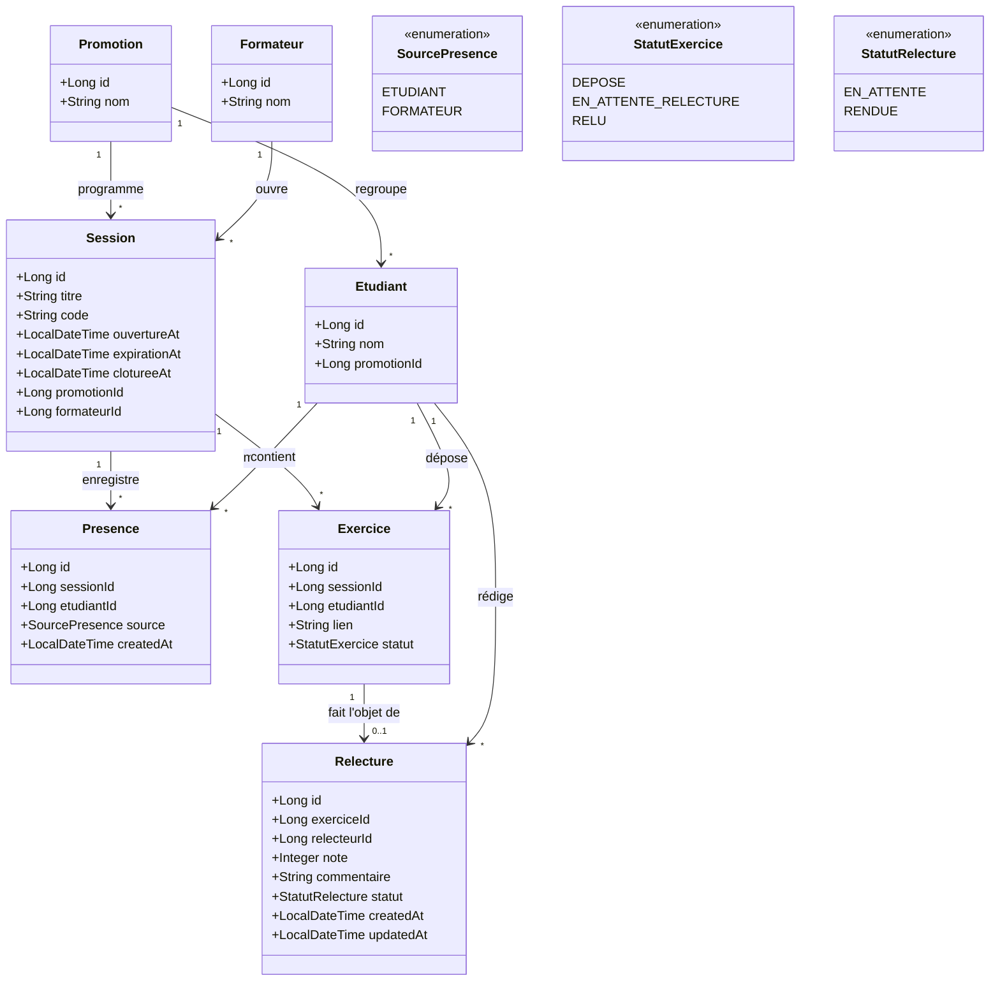

# D2 — Diagramme de classes (modèle de données)

Correspond aux migrations Flyway `V1__init_schema.sql` (voir `backend/src/main/resources/db/migration/`).

**Contraintes d'unicité (posées en V1) :**
- `UNIQUE(session_id, etudiant_id)` sur `presence` — RG « déjà présent » (409)
- `UNIQUE(session_id, etudiant_id)` sur `exercice` — RG « exercice déjà déposé » (409)
- `UNIQUE(exercice_id)` sur `relecture` — RG5 « un seul relecteur »

**Cardinalité notable :** `Exercice "1" --> "0..1" Relecture` — un exercice peut exister **sans** relecture (statut `DEPOSE`, cas Q7 × Q12, voir CDC section 7).
