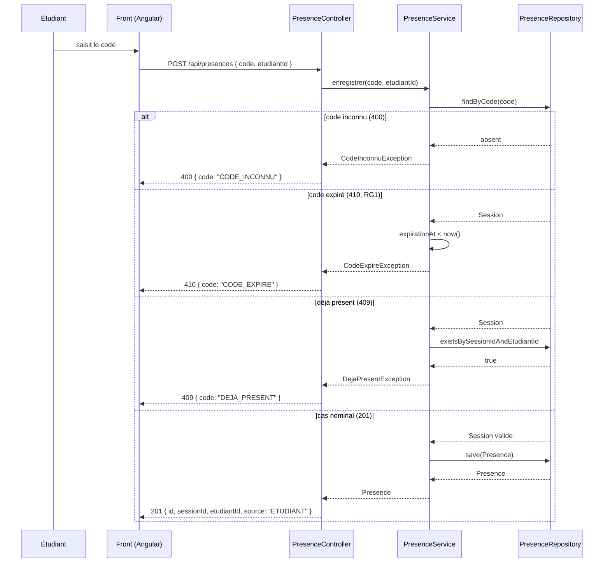

# D3 — Séquence : marquer sa présence

Cas nominal + deux cas d'erreur (RG1 : code expiré, RG « déjà présent »). Correspond aux codes HTTP du contrat.

**Cas d'erreur couverts :** code inconnu, code expiré (RG1), déjà présent.
